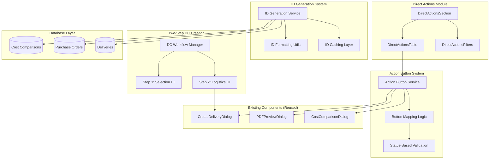
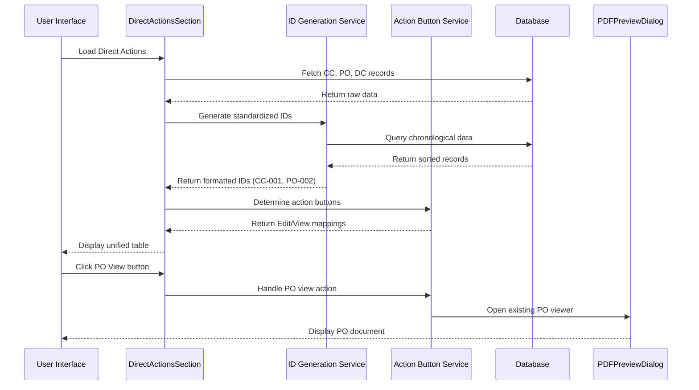

# Design Document: Direct Action System Finalization

## Overview

The Direct Action System Finalization feature enhances the existing Direct Actions module to provide a standardized, user-friendly interface for managing Cost Comparisons (CC), Purchase Orders (PO), and Delivery Challans (DC). This system eliminates implementation gaps, standardizes document identification, and provides seamless integration with existing validated UI components.

The design focuses on five key areas:
1. **Standardized ID System**: Sequential three-digit padded identification (CC-001, PO-002, DC-003)
2. **Dynamic Action Button System**: Status-based button mapping with Edit/View modes
3. **Two-Step DC Creation Flow**: Guided workflow for direct delivery challan creation
4. **Code Reuse Strategy**: Maximum utilization of existing validated components
5. **Database Schema Enhancements**: Support for chronological ID generation and custom titles

## Architecture

### System Components



### Data Flow Architecture



## Components and Interfaces

### 1. Standardized ID System

#### ID Generation Service
```typescript
interface IDGenerationService {
  generateStandardizedId(
    items: Array<{ createdAt: number; _id: string }>,
    currentItem: { createdAt: number; _id: string },
    type: "cc" | "dc" | "po"
  ): string;
  
  formatEntityId(
    entity: any,
    type: "cc" | "dc" | "po",
    allItems?: Array<{ createdAt: number; _id: string }>
  ): string;
  
  getCachedId(entityId: string, type: string): string | null;
  setCachedId(entityId: string, type: string, formattedId: string): void;
}
```

#### Implementation Strategy
- **Database Query Pattern**: Fetch all documents of each type, sort by `createdAt` timestamp
- **Sequential Numbering**: Calculate position in chronologically sorted list (0-based index + 1)
- **Padding Format**: Convert to three-digit padded format (001, 002, 003...)
- **Prefix Application**: Combine type prefix with padded number (CC-001, PO-002, DC-003)
- **Caching Strategy**: Cache generated IDs to avoid recalculation during session

### 2. Dynamic Action Button System

#### Action Button Service
```typescript
interface ActionButtonService {
  getActionButtonType(item: DirectActionItem): "edit" | "view";
  isItemEditable(item: DirectActionItem): boolean;
  handleAction(item: DirectActionItem, resetCallback: () => void): void;
}

interface ActionButtonMapping {
  cc: {
    draft: "edit";
    cc_pending: "view";
    cc_approved: "view";
    cc_rejected: "view";
  };
  dc: {
    pending: "edit";
    delivered: "view";
    cancelled: "view";
  };
  po: {
    [key: string]: "view"; // All PO statuses map to view
  };
}
```

#### Button Mapping Logic
- **CC Documents**: Edit mode for "draft" status, View mode for all other statuses
- **DC Documents**: Edit mode for "pending" and "draft" statuses, View mode for finalized statuses
- **PO Documents**: Always View mode (never editable as per specification)
- **Icon Mapping**: Edit = Pencil icon, View = Eye icon

### 3. Two-Step DC Creation Flow

#### Step 1: Selection Component
```typescript
interface DCSelectionStep {
  creationPath: "po" | "manual";
  selectedPOIds: Id<"purchaseOrders">[];
  manualItems: ManualItem[];
  
  validateSelection(): ValidationResult;
  proceedToLogistics(): void;
}

interface ManualItem {
  itemName: string;
  description: string;
  quantity: number;
  unit: string;
  rate: number;
  discount: number;
}
```

#### Step 2: Logistics Component (Reused)
- **Component**: Existing `CreateDeliveryDialog` component
- **Integration**: Pre-fill items from Step 1 selection
- **Validation**: Existing validation logic for Driver Name, Phone, Vehicle No., Transporter
- **Photo Upload**: Existing photo upload functionality maintained

#### Workflow State Management
```typescript
interface DCWorkflowState {
  step: 1 | 2;
  selectionData: {
    path: "po" | "manual";
    selectedPOs?: Id<"purchaseOrders">[];
    manualItems?: ManualItem[];
  };
  logisticsData: {
    driverName: string;
    driverPhone: string;
    vehicleNumber?: string;
    receiverName: string;
  };
}
```

### 4. PO View Integration

#### ViewPO Component Integration
```typescript
interface POViewIntegration {
  openPOViewer(poNumber: string): void;
  reusePDFPreviewDialog(poData: PurchaseOrder): void;
  maintainExistingFeatures(): {
    whatsappSharing: boolean;
    emailSending: boolean;
    downloadPDF: boolean;
    printDocument: boolean;
  };
}
```

#### Integration Points
- **Component Reuse**: Existing `PDFPreviewDialog` component
- **Parameter Passing**: Pass `poNumber` to existing viewer
- **Feature Parity**: Maintain all existing functionality (WhatsApp, email, download, print)
- **UI Consistency**: Same "Notion Electronics" document layout

## Data Models

### Enhanced Database Schema

#### Cost Comparisons Table
```typescript
// Existing fields maintained, new fields added:
interface CostComparison {
  // ... existing fields
  ccTitle?: string; // User-defined custom title (NEW)
  customTitle?: string; // Alternative field name for consistency (NEW)
}
```

#### Purchase Orders Table
```typescript
// Existing fields maintained, new fields added:
interface PurchaseOrder {
  // ... existing fields
  customTitle?: string; // User-defined custom title (EXISTING)
}
```

#### Deliveries Table
```typescript
// Existing fields maintained, new fields added:
interface DeliveryChallan {
  // ... existing fields
  customTitle?: string; // User-defined custom title (NEW)
}
```

### ID Generation Data Flow
```typescript
interface IDGenerationQuery {
  fetchAllByType(type: "cc" | "po" | "dc"): Promise<Array<{
    _id: string;
    createdAt: number;
  }>>;
  
  sortChronologically(items: any[]): any[];
  calculateSequentialPosition(targetId: string, sortedItems: any[]): number;
  formatWithPadding(position: number, prefix: string): string;
}
```

### Indexing Strategy
- **Existing Indexes**: Maintain all current database indexes
- **New Index Consideration**: `createdAt` field already indexed for chronological queries
- **Performance Optimization**: Cache formatted IDs during session to reduce database queries
- **Migration Strategy**: No database migration required (additive changes only)

## Error Handling

### Validation Error Handling

#### Step 1 Validation (DC Creation)
```typescript
interface Step1ValidationErrors {
  noPOSelected: "Please select at least one Purchase Order";
  noValidManualItems: "Please add at least one valid item with all required fields";
  missingRequiredFields: "Please fill in all required fields for manual items";
}
```

#### Step 2 Validation (Logistics)
```typescript
interface Step2ValidationErrors {
  missingDriverPhone: "Driver Phone is required";
  missingReceiverName: "Receiver Name is required";
  invalidPhoneFormat: "Please enter a valid phone number";
}
```

#### ID Generation Error Handling
```typescript
interface IDGenerationErrors {
  databaseQueryFailed: "Failed to fetch chronological data";
  invalidEntityType: "Unknown entity type for ID generation";
  concurrentCreationConflict: "ID conflict detected, retrying...";
}
```

### Error Recovery Strategies
- **Graceful Degradation**: Fall back to legacy ID format if generation fails
- **Retry Logic**: Implement retry mechanism for database query failures
- **User Feedback**: Clear error messages with actionable guidance
- **Logging**: Comprehensive error logging for debugging and monitoring

## Testing Strategy

### Unit Testing Approach
- **ID Generation Logic**: Test chronological sorting and padding format
- **Action Button Mapping**: Test status-based button type determination
- **Validation Logic**: Test Step 1 and Step 2 validation rules
- **Component Integration**: Test existing component reuse patterns

### Integration Testing Focus
- **Database Queries**: Test chronological ID generation with real data
- **Component Interaction**: Test dialog opening and data passing
- **Workflow State**: Test two-step DC creation state management
- **Error Scenarios**: Test validation failures and error recovery

### Property-Based Testing Assessment
This feature is **NOT suitable** for property-based testing because:
- **UI Component Integration**: Testing focuses on component interaction and user workflows
- **Database Configuration**: Testing involves database schema and query patterns
- **Existing Component Reuse**: Testing validates integration with existing validated components
- **Workflow State Management**: Testing involves multi-step user interaction flows

**Alternative Testing Strategies**:
- **Snapshot Tests**: For UI component rendering consistency
- **Integration Tests**: For database query patterns and component interaction
- **Mock-Based Tests**: For testing component reuse and dialog integration
- **End-to-End Tests**: For complete workflow validation

### Test Coverage Requirements
- **ID Generation**: 100% coverage of formatting and caching logic
- **Action Buttons**: 100% coverage of status-based mapping
- **Validation**: 100% coverage of Step 1 and Step 2 validation rules
- **Component Integration**: Integration tests for all reused components
- **Error Handling**: Tests for all defined error scenarios and recovery paths